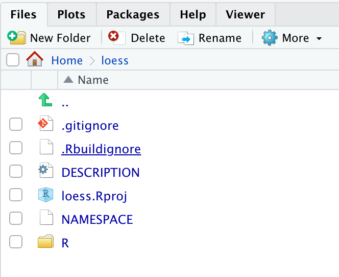
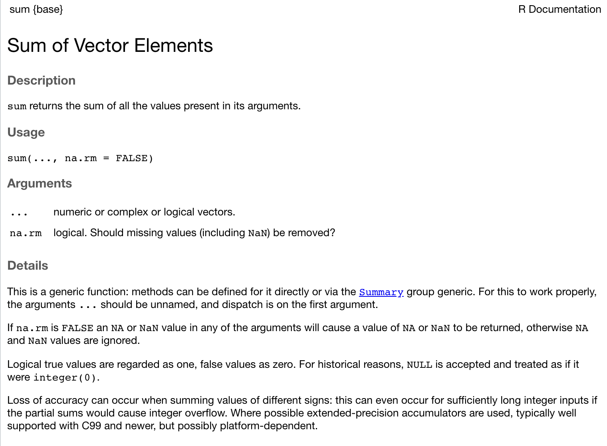
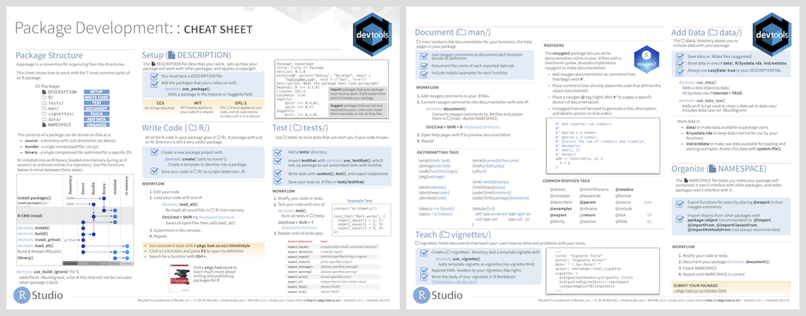

```{r setup, include = FALSE}
library("knitr")
library("tidyverse")
library("usethis")
library("testthat")

options(width = 120)
opts_chunk$set(digits = 3, width = 120)

knitr::opts_chunk$set(warning = FALSE, message = FALSE, error = FALSE, 
					  fig.width = 12, fig.height=7, fig.align = 'center',
					  digits = 3) 

# The following is to fix a DT::datatable issue with Xaringan
# https://github.com/yihui/xaringan/issues/293
options(htmltools.dir.version = FALSE, htmltools.preserve.raw = FALSE)

# This style was adapted from Max Kuhn: https://github.com/rstudio-conf-2020/applied-ml
# And Rstudio::conf 2020: https://github.com/rstudio-conf-2020/slide-templates/tree/master/xaringan
# This slide deck shows a lot of the features of Xaringan: https://www.kirenz.com/slides/xaringan-demo-slides.html

# To use, add this to the slide title:   `r I(hexes(c("DATA606")))`
# It will use images in the images/hex_stickers directory (i.e. the filename is the paramter)
hexes <- function(x) {
  x <- rev(sort(x))
  markup <- function(pkg) glue::glue('')
  res <- purrr::map_chr(x, markup)
  paste0(res, collapse = "")
}
```

# Agenda

* Overview of packages
	* Creating a package
	* Documenting a package
	* Testing a package
	* Building a package

* Demo

* Including Shiny apps in packages

* Releasing packages to Github and CRAN

* Conclusions / Additional Resources

---
class: inverse, middle, center
# Overview of R Packages

---
# What is an R package?

R packages are the basic unit of sharing code, data, documentation, and tests. It is a standardized format that allows for extending the R language. There are currently `r prettyNum(nrow(available.packages(repos='https://cran.r-project.org')), big.mark = ',')` packages listed on the [Comprehensive R Archive Network](https://cran.r-project.org). You are probably already using packages, installed using `install.packages` (or `remotes::install_github`) and loaded using `library` or `require`. 


---
# Setup

To develop R packages we are going to need some additional developer tools. This command will install the packages necessary for package development: 

```{r, eval=FALSE}
install.packages(c('devtools', 'roxygen2', 'usethis', 'testthat', 'kntir', 'vdiffr'))
```

Windows users will need to have Rtools installed. It can be downloaded from here: https://cran.r-project.org/bin/windows/Rtools/

Mac users need to have Xcode command line tools installed. Download Xcode from here: https://apps.apple.com/us/app/xcode/id497799835?mt=12 Once installed, fun the following command in the Terminal:

```
xcode-select --install
```

Linux users need to install the R development tools. If on Ubuntu, for example, install `r-base-dev`.

---
# Creating an R Package `r hexes('usethis')`

The `usethis` package provides a helper function that will initialize an R package for you.

```{r, eval=FALSE}
library(usethis)
path <- '~/loess'
create_package(path)
proj_activate(path)
```

The result of above will create a new directory with the basic files for an R package. Additionally, it will create a new RStudio project and open that project to begin editing.

---
# Package Structure

.pull-left[
* `.gitignore` - anticipates Git usage and ignores some standard, behind-the-scenes files created by R and RStudio. Even if you do not plan to use Git, this is harmless.
* `.Rbuildignore` - lists files that we need to have around but that should not be included when building the R package from source.
* `DESCRIPTION` - provides metadata about your package. 
* `loess.Rproj` - RStudio project file (note that this will have the name specified in `create_package`).
* `NAMESPACE` - declares the functions your package exports for external use and the external functions your package imports from other packages. *Do not edit this file directly.*
* `R/` - Directory where your R functions will reside.
]
.pull-right[

]


---
# DESCRIPTION File

The `DESCRIPTION` file contains important metadata about your package. The following is the default after creating your package with `create_package()`:

```
Package: loess
Title: What the Package Does (One Line, Title Case)
Version: 0.0.0.9000
Authors@R: 
    person("First", "Last", , "first.last@example.com", role = c("aut", "cre"),
           comment = c(ORCID = "YOUR-ORCID-ID"))
Description: What the package does (one paragraph).
License: MIT + file LICENSE
Encoding: UTF-8
Roxygen: list(markdown = TRUE)
RoxygenNote: 7.1.2
```

The title and description are particularly important as this is what will show up in the listing on CRAN if you publish there.

---
# DESCRIPTION File (cont.)

For the author(s), use the `person` function which includes the following parameters: `r paste0(names(formals(person)), collapse=', ')`. Roles can include any of the following: 

* `cre`: the creator or maintainer, the person you should bother if you have problems. Despite being short for “creator”, this is the correct role to use for the current maintainer, even if they are not the initial creator of the package.
* `aut`: authors, those who have made significant contributions to the package.
* `ctb`: contributors, those who have made smaller contributions, like patches.
* `cph`: copyright holder. This is used if the copyright is held by someone other than the author, typically a company (i.e. the author’s employer).
* `fnd`: funder, the people or organizations that have provided financial support for the development of the package.


There are other fields (described [here](https://r-pkgs.org/description.html#description-other-fields)) that may useful. The `URL` and `BugReports` are two common fields to add:

```
URL: https://github.com/jbryer/mypkg
BugReports: https://github.com/jbryer/mypkg/issues
```


---
# Package License `r hexes('usethis')`

The `usethis` package provides a number of helper functions to set the license for your package. If you plan to publish your package to CRAN, you must have a license. But even if you publish only to Github providing a license helps other useRs know the rules for using your package.

```{r, eval=TRUE}
ls('package:usethis')[grep('_license$', ls('package:usethis'))]
```

See https://choosealicense.com for more information on how to choose a license.


---
class: font80
# Package Dependencies `r hexes('usethis')`

It is very likely your package will require other packages to work. There are several ways you can determine the level of requirement for the dependency package.

* **Imports** - packages that needed for your package to work.
* **Suggests** - packages required for development or optional features.
* **Depends** - prior to R version 2.14.0 this was the only way to specify other packages your package requires. It is generally preferred to use *Imports* or *Suggests* now.
* **LinkingTo** - packages listed here rely on C or C++ code in another package.
* **Enhances** - packages listed here are *enhanced* by your package. Not commonly used so won't discuss here.

The `use_package` will add the specifications to the `DESCRIPTION` file. The `NAMESPACE` fill will also need to reflect what packages need to be loaded (and what objects from packages specifically), however that is done using Roxygen tags as described later.

```{r, eval=FALSE}
usethis::use_package('ggplot2', type = 'Imports')
```

Occasionally call the `use_tidy_description` function to cleanup your dependency list to a common format.

.font70[See this section of *R Packages* for more details: https://r-pkgs.org/description.html]


---
# Documenting with `roxygen2` `r hexes('roxygen2')`

R documentation is located in `.Rd` files and uses a LaTeX style syntax for formatting. The `roxygen2` package provides two key features:

1. Allows documentation to be located next to the source code (so you don't have to edit Rd files directly).

2. Allows documentation to be written in a more readable format using markdown. However, it will sometimes be necessary to use LaTeX style markup for some features.

Roxygen will look for comments within the R files that begin with `#'`  
(note the comment must start on the left margin).

We will cover the most common documentation features that will allow the package to pass a CRAN check. See https://roxygen2.r-lib.org/articles/rd.html for much more info. 

---
# Titles and Descriptions `r hexes('roxygen2')`

Each documentation block starts with some text that defines the title,  description, and details of the function or data. Here’s an example showing what the documentation for `sum()` might look like if it had been written with roxygen:

.pull-left[
```
#' Sum of vector elements
#'
#' `sum` returns the sum of all the values present in its arguments.
#'
#' This is a generic function: methods can be defined for it directly
#' or via the [Summary()] group generic. For this to work properly,
#' the arguments `...` should be unnamed, and dispatch is on the
#' first argument.
sum <- function(..., na.rm = TRUE) {}
```

* First sentence is the **title**.
* Second paragraph is the **description** which comes first and should be brief.
* The remaining paragraphs are the **details** which will appear after the argument descriptions.
]
.pull-right[

]


---
# Documentation Tags `r hexes('roxygen2')`

Object documentation using Roxygen has a number of tags to identify key parts of the help documentation. Most functions will have, at minimum, `@param`, `@return`, and `@examples`. And if it is a function available to the end user, it will also have`@export`.

* `@param name description` - Description for a function parameter. Note that all parameters must be documented to pass `check()`.
* `@return description` - Description of what the function returns.
* `@examples` - Example code that demonstrates the functionality for the function. This code will be run at build time. If there is code that you don't want to run at install/build time, you can surrond it with `\dontrun{}`. You should also this for any code that takes more than a few seconds to run.
* `@section title` - Adds arbitrary sections to teh documentation.
* `@inherit`, `@inheritParams`, and `@inheritSection` - Allows you to include documentation from another function.
* `@seealso` - Links to documentation of another function or dataset.
* `@export` - This function should be exported (i.e. made public) when the package is loaded by a user. If this is missing, then the function can only be used internally (or using the `package:::function` syntax).


---
class: font60
# Complete documentation for the `sum` function `r hexes('roxygen2')`

.pull-left[
```
#' Sum of vector elements
#'
#' `sum()` returns the sum of all the values present in its arguments.
#'
#' This is a generic function: methods can be defined for it directly
#' or via the [Summary] group generic. For this to work properly,
#' the arguments `...` should be unnamed, and dispatch is on the
#' first argument.
#'
#' @param ... Numeric, complex, or logical vectors.
#' @param na.rm A logical scalar. Should missing values (including `NaN`)
#'   be removed?
#' @return If all inputs are integer and logical, then the output
#'   will be an integer. If integer overflow 
#'   (<http://en.wikipedia.org/wiki/Integer_overflow>) occurs, the output
#'   will be NA with a warning. Otherwise it will be a length-one numeric or
#'   complex vector.
#'
#'   Zero-length vectors have sum 0 by definition. See
#'   <http://en.wikipedia.org/wiki/Empty_sum> for more details.
#' @export
#' @examples
#' sum(1:10)
#' sum(1:5, 6:10)
#' sum(F, F, F, T, T)
#'
#' sum(.Machine$integer.max, 1L)
#' sum(.Machine$integer.max, 1)
#'
#' \dontrun{
#' sum("a")
#' }
sum <- function(..., na.rm = TRUE) {}
```
]
.pull-right[
Run `?sum` to see the built documentation (the code has been truncated some to fit).


]

---
# Documenting data `r hexes('roxygen2')`

.pull-left[
Documentation for data follows the same structure as functions in terms of title, description, and details. However, there are two additional tags that are useful: 

* `@format` - Gives an overview of the structure of the dataset

* `@source` - Reference or URL where the data was retrieved from.
]
.pull-right[
```
#' x and y coordinates generated from a cubic function.
#'
#' This \code{data.frame} is used to show the features
#' of the \code{\link{loess_vis}} function with cubic 
#' data. It was generated using the following code:
#' 
#' \code{
#' set.seed(2112)
#' cubic_df <- tibble(
#' 	x = seq(-1, 1, by = 0.01),
#' 	y = x^3 + rnorm(length(x), mean = 0, sd = 0.05) - x
#' }
#'
#' @format A data frame with 201 rows and 2 variables:
#' \describe{
#'   \item{x}{independent variable}
#'   \item{y}{dependent variable}
#'   ...
#' }
#' @source Randomly generated data.
"cubic_df"
```
]

---
class: font90
# Package Documentation  `r hexes('roxygen2')`

In addition to documenting the objects (e.g. functions and data), you can use Roxygen to document the package. The title and description will be pulled from the `DESCRIPTION` file, so this is useful for providing additional details, keywords, and to define package dependencies.

```
usethis::use_package_doc()
```

* `@keywords` - List of keywords related to your package.

* `@import package` - This will indicate that the package needs to load the specified package to work.

* `@importFrom package function(s)` - This will indicate that the function(s) in the specified package are required to work. Note that the list of functions is space separated.

There are two approaches to handling `@import` and `@importFrome`: 1. Include them in all one location in the package documentation or 2. Include them with each function based upon what that function needs. If the later, it is ok if they are duplicated as Roxygen will handle that when we build the documentation files.

---
# Formatting within Documentation `r hexes('roxygen2')`

There will be a few instances where you will need to use LaTeX style markup within your documentation.

* `\code{}` - Will format the enclosing text in a fixed-width font typically for code references.

* `\link{}` - Will link to another function or dataset within the help documentation. Alternatively, you can no use `[function()]` markdown syntax to link to other function documentation.

* `\dontrun{}` - Used in `@examples` sections for code that should not be run when the package is built or installed.

* `\describe{\item{}{}}` - When you wish to create a list. Often used for describing data and functions that return complex lists.


---
# Vignettes `r hexes(c('knitr', 'rmarkdown'))`

Vignettes are long form documents describing utilizing your package. I recommend writing your vignettes in Rmarkdown. The `use_vignette` function will create a new vignette.

```
usethis::use_vignette("loess")
```

This will specifically:

1. Create the `vignettes/` directory.

2. Add the necessary dependencies to the `DESCRIPTION` file.

3. Create a draft file `vignettes/loess.Rmd`.

You can edit this file using the same Rmarkdown syntax used elsewhere. For details on formatting, see https://r-pkgs.org/vignettes.html


---
class: font80
# Testing `r hexes(c('testthat', 'usethis'))`

It is important to test your package. The `testthat` package provides a framework for writing tests that integrates into the development process. This way, each time you build your package all tests are run.

.pull-left[
First, we need to setup our package for testing using the `testthat` package.

```{r, eval=FALSE}
usethis::use_testthat()
```

This will:

1. Create a `tests/testthat` directory.

2. Add testthat to the Suggests field in the DESCRIPTION.

3. Create a file `tests/testthat.R` that runs all your tests when R CMD check runs. 
]
.pull-right[

Typical workflow will be:

1. Create a test with `usethis::use_test('TEST_NAME')`.

2. Modify your code and/or test.

3. Run your tests with `devtools::test()`.

4. Repeat 2 and 3 until your tests run without error.

5. Repeat steps 1 through 4 until all of your code within the package has been tested.

]


---
# Testing `r hexes(c('testthat'))`

Tests are organized as:

* **Expectations** - The basic level of testing.
* **Test Groups** - A grouping of one or more expectations. 

Consider the following test group with three expectations:

```{r, eval=FALSE}
test_that("numbers are equivelent", {
	expect_equal(10, 10 + 1e-7)     # This will pass.
	expect_identical(10, 11)        # This will not pass
	expect_identical(10, 10 + 1e-7) # This will not pass
  
})
```

--

> Whenever you are tempted to type something into a print statement or a debugger expression, write it as a test instead. — Martin Fowler

---
# Expectations `r hexes(c('testthat'))`

The `testthat` package provides a lot of functions to check the expected outcome from your tests. They all have two arguements: 1. The actual result and 2. What is expected. If they don't match, an error is thrown.

```{r}
ls('package:testthat')[grep('^expect_', ls('package:testthat'))]
```


---
# Testing Visualizations `r hexes(c('testthat', 'ggplot2', 'usethis'))`

The [`vdiffr` package](https://github.com/r-lib/vdiffr) is an extension to `testthat` that will monitor R plots. The first time the test is run the image is saved so that subsequent tests will compare the output to the previous version. If the there are differences, the `testthat::snapshot_review()` will allow you to review the differences.


```{r, eval=FALSE}
test_that("loess_vis works", {
	data("cubic_df")
	p <- loess_vis(y ~ x, data = cubic_df)
	vdiffr::expect_doppelganger("default loess_vis", p)
})
```


---
# Building your package `r hexes(c('devtools', 'roxygen2', 'testthat'))`

.pull-left[
### Building

Generate the documentation files from the source files.

```{r, eval=FALSE}
document()
```

Build the package as a binary.

```{r, eval=FALSE}
build()
```

Install the package.

```{r, eval=FALSE}
install()
```
]
.pull-right[
### Testing

Run the tests.

```{r, eval=FALSE}
test()
```

Check your package for any errors.

```{r, eval=FALSE}
check()
```
]

---
class: inverse, middle, center
# Demo


---
# Working Example

We will convert the Loess regression function and Shiny app created in a past talk into an R package. https://albanyrusers.org/post/2021-11-30-intro_to_shiny/

```{r, fig.height = 4}
source('2022-03-01-R_Package_Development/Shiny_Loess/loess_vis.R')
data("faithful")
loess_vis(eruptions ~ waiting, data = faithful)
```

---
class: inverse, middle, center
# Shiny Apps in R Packages


---
class: font90
# Including shiny apps in R Packages `r hexes(c('shiny'))`

**Option One**: Include the shiny app in the `inst/` directory, for example `inst/shiny/`. You can then write a function that starts the app from that director.

```{r, eval=FALSE}
#' My Shiny App
#' @export
my_shiny_app <- function() {
    shiny::runApp(appDir = system.file('shiny', package='loess'))
}
```


---
class: font90
# Including shiny apps in R Packages `r hexes(c('shiny'))`

**Option Two**: Define the Shiny server and ui as functions within the package. The advantage of this approach is you can pass startup parameters to the Shiny app. Consider this simple Shiny app that displays a data frame.

.pull-left[
```{r, eval=FALSE}
shiny_server <- function(input, output, session) {
    if(!exists('thedata', 
    		   envir = parent.env(environment()),
    		   inherits = FALSE)) {
        message('thedata not available...')
        data(faithful, envir = environment())
        thedata <- faithful
    }
    output$thedata <- renderTable({
        return(thedata)
    })
}
```
]
.pull-right[
```{r, eval=FALSE}
shiny_ui <- function() {
    fluidPage(
        titlePanel('Shiny Parameter Test'),
		tableOutput('thedata')
    )
}
```
]

Note that function checks for `thedata` in the environment. If it doesn't exist it creates the object and sets it equal the `faithful` data frame. In the standalone Shiny app, `thedata` was set in `global.R`.

---
# Including shiny apps in R Packages `r hexes(c('shiny'))`

.pull-left[
```{r, eval=FALSE}
runShinyApp <- function(thedata, ...) {
	shiny_env <- new.env()
	# Set names parameters
	if(!missing(thedata)) {
		assign('thedata', thedata, shiny_env)
	}
	# Set other parameters from the ... operator
	params <- list(...)
	for(i in seq_len(length(params))) {
		assign(names(params[i]), params[[i]], 
			   shiny_env)
	}
	environment(shiny_ui) <- shiny_env
	environment(shiny_server) <- shiny_env
	app <- shiny::shinyApp(
		ui = shiny_ui,
		server = shiny_server
	)
	environment(app) <- shiny_env
	runApp(app)
}
```
]
.pull-right[
This function can easily be reused in your own package. Note that it assigns both named parameters (in this example `thedata`) as well as arbitrary parameters specified with the `...` operator. For example, this call will not only change `thedata` in the Shiny app, but will also pass `some_other_var` to the Shiny app.

```{r, eval=FALSE}
runShinyApp(
	thedata = mtcars,
	some_other_var = 'Some value')
```
.font70[Read more here: https://bryer.org/post/2021-02-12-shiny_apps_in_r_packages/]

]

---
class: inverse, middle, center
# Releasing the package to the world

---
# Github `r hexes(c('usethis', 'devtools'))`

The `use_git` will initialize a git repository for your package (from the current working directory). The `use_github` will then publish it to Github. 

```{r, eval=FALSE}
usethis::use_git()
usethis::use_github()
```

Once the package is on Github, it can be installed using:

```{r, eval=FALSE}
remotes::install_github('jbryer/loess')
```

---
# CRAN `r hexes(c('devtools'))`

If your package is ready to release to CRAN (no errors, warnings, or notes from running `check()`), the `devtools::release()` will guide you through the process of publishing your package to CRAN. You will:

1. Confirm that you have read the [CRAN Repository Policy](https://cran.r-project.org/web/packages/policies.html)

2. Created a `cran-comments.md` file with comments submitted to the CRAN maintainers.

```{r, eval=FALSE}
release()
```

Good luck and don't be discouraged if your package doesn't get approved on the first attempt.

---
# Build a website `r hexes('pkgdown')`

The `pkgdown` package is a quick and easy way to create a website for your package. It will use the documentation you have already written within your R scripts, vignettes, and README for the site contents.

The `use_pkgdown()` call will configure your package to use `pkgdown` (only needs to be called once). Then `build_site()` will build the site into the `docs/` direcotry.

```{r, eval=FALSE}
usethis::use_pkgdown()
pkgdown::build_site()
```

Once published to Github, you can configure [Github Pages](https://pages.github.com) to host the site from the `docs/` directory. This is located in the Setting section of your repository.

---
class: inverse, middle, center
# Wrap Up

---
# Additional Resources

* *R Packages* book by Hadley Wickham: https://r-pkgs.org/index.html

* *Happy Git and Github for the useR* by Jennifer Bryan

* `usethis` package documentation: https://usethis.r-lib.org/index.html

* `devtools` package documentation: https://devtools.r-lib.org

* `roxygen2` package documentation: https://roxygen2.r-lib.org/index.html

* `pkgdown` package documentation: https://pkgdown.r-lib.org

* Writing R Extensions documentation: https://cran.r-project.org/manuals.html#R-exts

---
# Devtools Cheatsheet

[](https://rawgit.com/rstudio/cheatsheets/main/package-development.pdf)

Other cheatsheets available here: https://www.rstudio.com/resources/cheatsheets/

---
class: inverse, right, middle, hide-logo


# Thank you!

[`r icons::fontawesome("paper-plane")` jason.bryer@cuny.edu](mailto:jason.bryer@cuny.edu)  
[`r icons::fontawesome("github")` @jbryer](https://github.com/jbryer)  
[`r icons::fontawesome("twitter")` @jbryer](https://twitter.com/jbryer)  
[`r icons::fontawesome("link")` bryer.org](https://bryer.org)   


